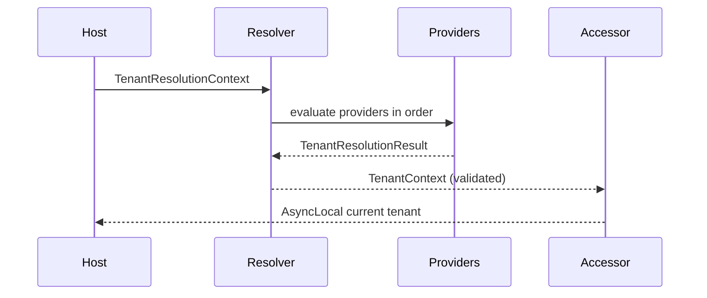

# Extension: Multitenancy Core

## Overview
Host-agnostic multitenancy primitives for Clean Architecture solutions. The core package defines tenant identity, resolution pipeline, current-tenant access, validation hooks, and MediatR behaviors without requiring ASP.NET Core or EF Core. You bring the host adapter that populates a `TenantResolutionContext`.

## When to use
- You need per-tenant isolation (data access, caching, authorization, logging).
- You want pluggable tenant resolution strategies (host/header/route/claims).
- You want pipeline-level tenant enforcement without sprinkling tenant checks across handlers.

## Prereqs & Compatibility
- Target frameworks: `net10.0`.
- Dependencies: MediatR `13.1.0`, Microsoft.Extensions.* (`DependencyInjection`, `Logging`, `Options`).
- Host adapter required: build `TenantResolutionContext` in your web/API/worker host.

## Install

```bash
dotnet add src/Application/Application.csproj package CleanArchitecture.Extensions.Multitenancy
dotnet add src/Infrastructure/Infrastructure.csproj package CleanArchitecture.Extensions.Multitenancy
```

## Quickstart

### Register services

```csharp
using CleanArchitecture.Extensions.Multitenancy;
using CleanArchitecture.Extensions.Multitenancy.Configuration;

services.AddCleanArchitectureMultitenancy(options =>
{
    options.HeaderNames = new[] { "X-Tenant-ID" };
    options.RouteParameterName = "tenantId";
    options.QueryParameterName = "tenantId";
    options.ClaimType = "tenant_id";
});
```

### Resolve and set tenant context (host adapter)

Minimal ASP.NET Core middleware example:

```csharp
using CleanArchitecture.Extensions.Multitenancy;
using CleanArchitecture.Extensions.Multitenancy.Abstractions;

public sealed class TenantResolutionMiddleware
{
    private readonly RequestDelegate _next;

    public TenantResolutionMiddleware(RequestDelegate next) => _next = next;

    public async Task InvokeAsync(HttpContext httpContext, ITenantResolver resolver, ITenantAccessor accessor)
    {
        var context = new TenantResolutionContext
        {
            Host = httpContext.Request.Host.Host,
            CorrelationId = httpContext.TraceIdentifier
        };

        foreach (var header in httpContext.Request.Headers)
        {
            context.Headers[header.Key] = header.Value.ToString();
        }

        foreach (var route in httpContext.Request.RouteValues)
        {
            if (route.Value is not null)
            {
                context.RouteValues[route.Key] = route.Value.ToString()!;
            }
        }

        foreach (var query in httpContext.Request.Query)
        {
            context.Query[query.Key] = query.Value.ToString();
        }

        if (httpContext.User?.Identity?.IsAuthenticated == true)
        {
            foreach (var claim in httpContext.User.Claims)
            {
                context.Claims[claim.Type] = claim.Value;
            }
        }

        var tenantContext = await resolver.ResolveAsync(context, httpContext.RequestAborted);
        using (accessor.BeginScope(tenantContext))
        {
            await _next(httpContext);
        }
    }
}
```

### Add pipeline behaviors

```csharp
using CleanArchitecture.Extensions.Multitenancy.Behaviors;
using MediatR;

services.AddMediatR(cfg =>
{
    cfg.RegisterServicesFromAssemblyContaining<Program>();
    cfg.AddCleanArchitectureMultitenancyPipeline();
    cfg.AddOpenBehavior(typeof(TenantScopedCacheBehavior<,>)); // optional
});
```

## How it works



- Providers return `TenantResolutionResult` with candidates and confidence.
- The resolver validates against cache/store if configured.
- MediatR behaviors enforce tenant requirements and enrich logging scope.

## Key components

- `TenantInfo`, `TenantContext`, `TenantResolutionContext`, `TenantResolutionResult`.
- Providers: route, host, header, query string, claim, default, custom delegate.
- Behaviors: validation, enforcement, correlation, cache scope warning.
- `ITenantInfoStore`, `ITenantInfoCache`, `ITenantContextSerializer`.

## Security and operational notes

- Enable validation (`TenantValidationMode.Cache` or `Repository`) to prevent spoofed tenant IDs.
- Use `RequireMatchAcrossSources` to enforce consensus across header/route/host claims.
- Configure `HostTenantSelector` if subdomain parsing rules differ.
- Background jobs should always restore tenant context via `ITenantAccessor.BeginScope`.

## Deep dive pages

- Resolution pipeline: `multitenancy-core/resolution-pipeline.md`
- Requirements and behaviors: `multitenancy-core/requirements-and-behaviors.md`
- Validation and stores: `multitenancy-core/validation-and-stores.md`
- Context propagation: `multitenancy-core/context-propagation.md`
- Caching integration: `multitenancy-core/caching-integration.md`
- Options reference: `../reference/multitenancy-options.md`
- Troubleshooting: `../troubleshooting/multitenancy.md`

## Troubleshooting

- Tenant not resolved: confirm provider order and ensure `TenantResolutionContext` is populated.
- Validation warnings: register `ITenantInfoStore`/`ITenantInfoCache` when using cache/repository validation.
- Ambiguous candidates: ensure headers/queries contain only one tenant ID.

## Related modules

- Multitenancy.AspNetCore (shipped)
- Multitenancy.EFCore (shipped)
- Multitenancy.Identity (planned)
- Multitenancy.Provisioning (planned)
- Multitenancy.Redis (planned)
- Multitenancy.Sharding (planned)
- Multitenancy.Storage (planned)
